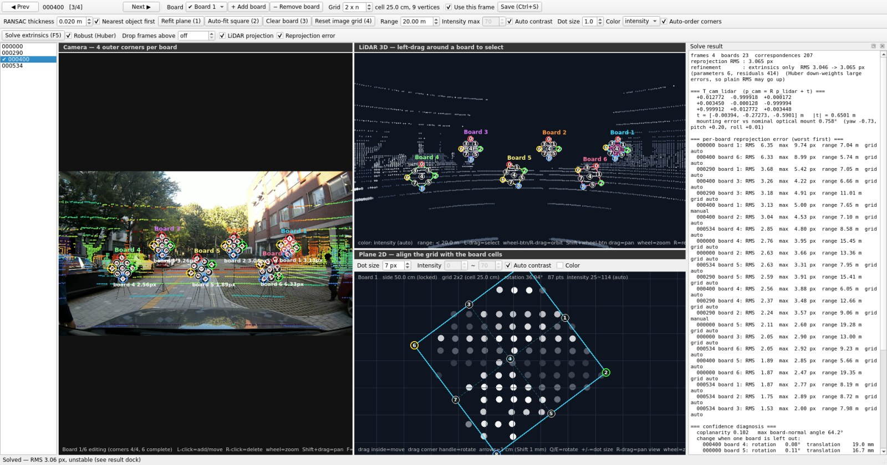
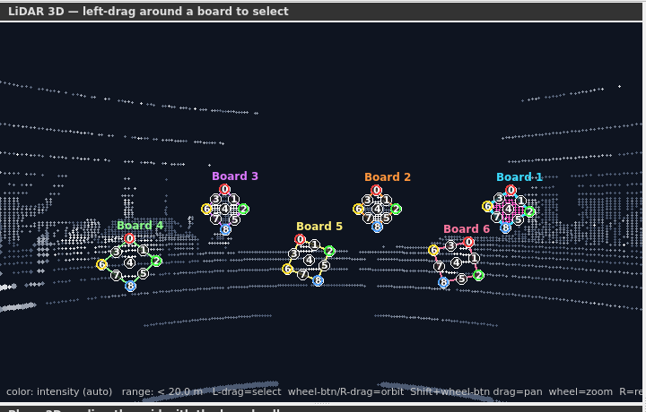
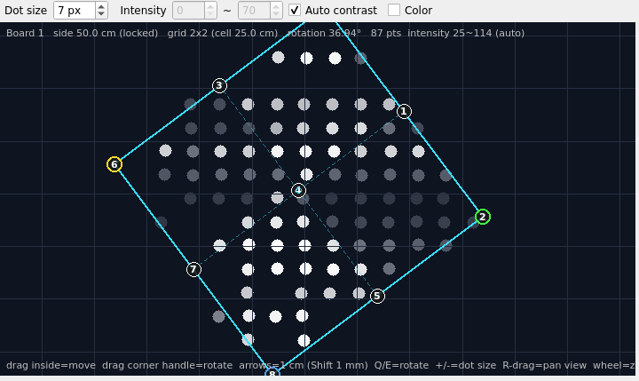

# calibration_GUI

Camera–LiDAR extrinsic calibration toolkit. A 50 cm black/white 2×2 checkerboard is used
as a planar target; a human labels the boards in a GUI and PnP solves `T_cam_lidar`.

- **No ROS installation required** — rosbag2 CDR payloads are decoded in pure Python
- LiDAR side: drag-select → RANSAC plane → hand-align a 50 cm square whose **size is locked**
- Camera side: click the 4 outer corners → grid points are generated; interior points can be
  dragged onto the real checker intersections for precision
- Label quality is judged by leave-one-out stability, not by reprojection RMS alone

## Screenshots

Labeling GUI — camera view with numbered grid vertices (left), LiDAR 3D view with the
selected boards (top right), in-plane 2D view where the size-locked 50 cm square is aligned
with the checker cells (bottom right), and the solve result dock:



| LiDAR 3D view — six labeled boards, viewed head-on | Plane 2D view — grid aligned with the black/white cells |
|:--:|:--:|
|  |  |

Full usage and folder layout: [tools/README.md](tools/README.md).
Calibration procedure, accuracy and pitfalls: [tools/calibration/README.md](tools/calibration/README.md).

## Quick start

```bash
conda create -n vilab_calib python=3.10 -y && conda activate vilab_calib
pip install -r tools/requirements.txt
conda install -y -c conda-forge xcb-util-cursor            # for the Qt xcb platform plugin
P=$(python -c "import PySide6,os;print(os.path.dirname(PySide6.__file__))")
ln -sf $CONDA_PREFIX/lib/libxcb-cursor.so.0 $P/Qt/lib/libxcb-cursor.so.0

# Try it on the bundled sample (the raw bags / full extractions are not in the repo)
python tools/gui/main.py                    --dataset data/samples/sonata_front_cal_0916
python tools/calibration/check_labels.py    --dataset data/samples/sonata_front_cal_0916
python tools/calibration/solve_extrinsic.py --dataset data/samples/sonata_front_cal_0916
python tools/calibration/project_lidar.py   --dataset data/samples/sonata_front_cal_0916 --labeled-only
```

## Data

```
data/
├── samples/      a few labeled frames + labels + intrinsics/extrinsics (in repo, a few MB)
├── intrinsics/   measured camera intrinsics: indoor 640x480 + Sonata cam0 x3 (in repo)
├── bag_data/     raw rosbag2 recordings          (.gitignore)
└── export_data/  extracted png/pcd, videos       (.gitignore)
```

| Sample | Sensors | Contents |
|--------|---------|----------|
| `sonata_front_cal_0916` | cam0 1280×720 + VLP-32, outdoor | 4 labeled frames · 23 boards · 207 correspondences · `extrinsic.json` included |
| `rosbag2_2026_09_10_camera_extrinsic` | 640×480 + VLP-16, indoor | 2 labeled frames · 4 boards · 36 correspondences |

To rebuild a sample from a full extraction use `tools/extraction/make_sample.py`.

## Camera intrinsics

This toolkit solves **extrinsics only**; the camera intrinsics (K, D) are an input and are
kept fixed. Calibrate them with the standard ROS 2 `camera_calibration` package
(a printed checkerboard, `cameracalibrator`):

```bash
# ROS 2 (Humble): calibrate cam0 with an 8x6 checkerboard of 25 mm squares
sudo apt install ros-humble-camera-calibration
ros2 run camera_calibration cameracalibrator --size 8x6 --square 0.025 \
    image:=/cam0/image_raw camera:=/cam0
# after "CALIBRATE" -> "SAVE": /tmp/calibrationdata.tar.gz contains ost.txt / ost.yaml
```

Either file is accepted by the tools here (`--intrinsic` on `export_bag.py`, or
`tools/calibration/set_intrinsic.py --file`). Take a few runs and use the median if they
disagree — on our cam0 three runs gave fx = 684 / 719 / 691. Only the intrinsics step uses
ROS; everything else in this repository runs without a ROS installation.

## Pipeline

```
rosbag2 ──extraction/export_bag.py──────────▶ png + pcd (time-synced pairs)
        ──gui/main.py───────────────────────▶ board_annotations.json  (human labeling)
        ──calibration/check_labels.py───────▶ are the labels sufficient?
        ──calibration/solve_extrinsic.py────▶ extrinsic.json  (T_cam_lidar)
        ──calibration/project_lidar.py / make_video.py──▶ visual verification
```

Note: code comments, documentation and the GUI are in English; CLI console messages are still in Korean.
